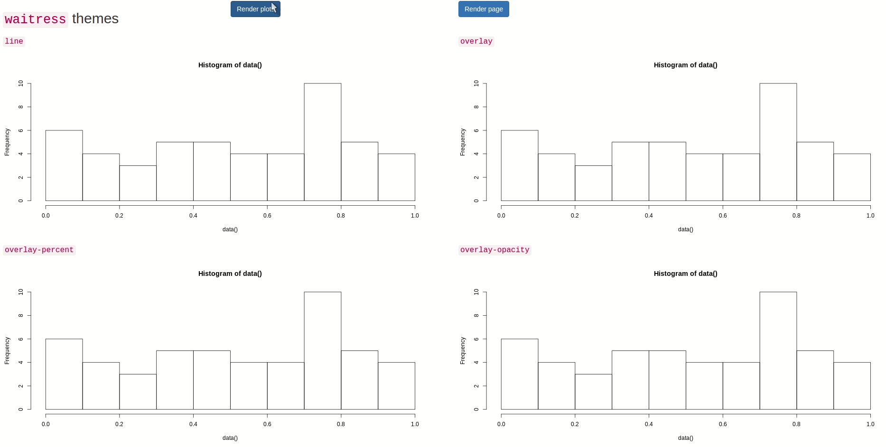
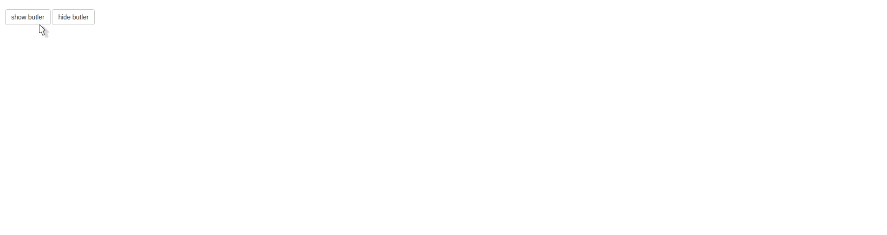

[](https://travis-ci.org/JohnCoene/waiter)


# waiter

Loading screens for Shiny; programatically show and hide partial or full page loading screens, comes with multiple spinners.

* [Features](#features)
* [Installation](#installation)
* [How-to](#how-to)
* [Demo](https://shiny.john-coene.com/waiter/)
* [Examples](#examples)
* [Credit](#credit)

## Features

The {waiter} package has evolved since version `0.0.1` and now includes:

* A waiter, splash loading screens.
* A waitress, loading bars on on elements or whole screen.
* A butler, infinite loading bar.

You can see the difference between each member of staff [here](https://shiny.john-coene.com/waiter/).

## Installation

Stable version from CRAN:

```r
install.packages("waiter")
```

Development version from Github: 

``` r
# install.packages("remotes")
remotes::install_github("JohnCoene/waiter")
```

## How to

### Waiter

1. Place `use_waiter` anywhere in your UI.
2. Programatically call `show_waiter`.
3. Don't forget to programatically hide the loading screen with `hide_waiter`.

Since version `0.0.2` you can also place `show_waiter_on_load` in your UI, _below_ `use_waiter` in order to show a loading screen prior to the `session` loads, this splash screen is not programatically triggered but is also hidden with `hide_waiter`.

See `?spinners` for a list of all the spinners.

### Waitress

Note that the waitress is a reference class.

1. Place `use_waitress` anywhere in your UI.
2. Set up the waitress in your server with `call_waitress` or `Waitress$new()`.
3. Programatically call the `set`, `increase`, and `auto` _methods_.
4. Don't forget to programatically hide the loading screen with the `hide` _method_.

See `?waitress` for the documentation.

### butler

1. Place `use_butler` anywhere in your UI.
2. Call `show_butler` in your server.
3. Don't forget to programatically hide the loading screen with `hide_butler`.

You can, optionally, configure the butler with `config_butler`.

### hostess

1. Place `use_hostess` anywhere in your UI.
2. Place a `hostess_loader` where you want the bar to show.
3. Call `Hostess$new()` in your server to launch the hostess.
4. Increase the hostess with `Hostess$set`.

## Demos

The demos below are also on the [website](https://shiny.john-coene.com/waiter/).

### waiter

Browse the spinners locally with `waiter::browse_waiters()`


### waitress

Browse waitresses locally with `waiter::browse_waitresses()`



### butler



## Examples

### waiter

Basic example could be like this.

``` r
library(shiny)
library(waiter)
 
ui <- fluidPage(
  use_waiter(),
  actionButton("show", "Show loading for 3 seconds")
)

server <- function(input, output, session){
  observeEvent(input$show, {
    show_waiter(spin_fading_circles())
    Sys.sleep(3) # do something that takes time
    hide_waiter()
  })
}

if(interactive()) shinyApp(ui, server)
```

Since version `0.0.4` you can show on loading screen on app launch. The loading screen will launch prior to anything, even the Shiny session. Note that in `0.0.4` some content flashed before the loader appeared, this has been fixed in `0.0.5`.

Though this function is not programatically launched it still has to be hidden with `hide_waiter`. Ensure you place `show_waiter_on_load` after `use_waiter` and at _the very end of your UI_, also set `include_js` to `FALSE`, in `use_waiter`.

```r
library(shiny)
library(waiter)

Sy.sleep(1)
 
ui <- fluidPage(
  use_waiter(include_js = FALSE), # do not include js
  h3("Content you will only see after loading screen has disappeared"),
  show_waiter_on_load(spin_fading_circles()) # place at the bottom
)

server <- function(input, output, session){
  Sys.sleep(3) # do something that takes time
  hide_waiter()
}

if(interactive()) shinyApp(ui, server)
```

How it is used in [chirp.sh](https://chirp.sh), where it is combined with [pushbar](https://github.com/JohnCoene/pushbar) to get rid of the navbar alltogether.

```r
library(shiny)
library(waiter)

ui <- navbarPage(
  "example",
  id = "tabs",
    header = list(
        tags$style("nav{display:none;}") # hide navbar
    ),
  tabPanel(
    "home",
    use_waiter(),
    br(),
    actionButton("switch", "Go to networks tab")
  ),
  tabPanel(
    "networks",
    h3("Hello!")
  )
)

server <- function(input, output, session){
  observeEvent(input$switch, {

    # show loading
    show_waiter(
      tagList(
        spin_folding_cube(),
        span("Loading ...", style = "color:white;")
      )
    )
    # long~ish computation
    Sys.sleep(3)

    # send to "hidden" tab
    updateTabsetPanel(session = session, inputId = "tabs", selected = "networks")

    # hide loading
    hide_waiter()
  })
}

shinyApp(ui, server)
```

You can, since version `0.0.6` update the `html` of the waiting screen while it's loading.

```r
library(shiny)
library(waiter)
 
ui <- fluidPage(
  use_waiter(),
  actionButton("show", "Show loading with updates")
)

server <- function(input, output, session){
  observeEvent(input$show, {
    show_waiter(span("Initialisation", style = "color:white;"))
    Sys.sleep(2)
    for(i in 1:5){
      HTML <- span(paste("Loading #", i, "of 5"), style = "color:white;z-index:999;")
      update_waiter(html = HTML)
      Sys.sleep(2)
    }
    hide_waiter()
  })
}

if(interactive()) shinyApp(ui, server)
```

### waitress

The waitress can be applied to a specific element or the whole page. Note that `call_waitress` and `Waitress$new()` takes a CSS selector, so if you want to apply it to a plot use `#plotId`.

```r
library(shiny)
library(waiter)

ui <- fluidPage(
  use_waitress(),
  plotOutput("plot", width = 400)
)

server <- function(input, output){
  
  waitress <- call_waitress("#plot") # call the waitress
  
  output$plot <- renderPlot({
    waitress$start() # start the waitress
    
    dat <- vector()
    
    for(i in 1:10){
      waitress$increase(10) # increase by 10%
      Sys.sleep(.3)
      dat <- c(dat, sample(1:100, 1))
    }
    
    hist(dat)
    waitress$hide() # hide when done
	})

}

shinyApp(ui, server)
```

Because the waitress takes a seclector, we can apply it to different parts of the page, using a class or any other selector, like the `nav`.

```r
library(shiny)
library(waiter)

ui <- navbarPage(
  "Waitress on nav",
  tabPanel(
    "home",
    use_waitress(),
    plotOutput("plot")
    )
)

server <- function(input, output){
  
  waitress <- call_waitress("nav", theme = "overlay") # call the waitress
  
  output$plot <- renderPlot({
    waitress$start() # start the waitress
    
    dat <- vector()
    
    for(i in 1:10){
      waitress$increase(10) # increase by 10%
      Sys.sleep(.5)
      dat <- c(dat, sample(1:100, 1))
    }
    
    hist(dat)
    waitress$hide() # hide when done
	})

}

shinyApp(ui, server)
```

If you do not specify a selector to `call_waitress` then it is applied to the whole page. Note that you can change the color of the waitress in `use_waitress`.

```r
library(shiny)
library(waiter)

ui <- fluidPage(
  use_waitress(color = "#7F7FFF"),
  h2("waitress on entire page"),
  actionButton("load", "load")
)

server <- function(input, output){
  
  waitress <- Waitress$new(theme = "overlay-percent") # call the waitress
  
  observeEvent(input$load, {
    waitress$
      start()$
      auto(percent = 5, ms = 150) # increase by 5 percent every 150 milliseconds
      Sys.sleep(3.5)
    waitress$hide()
	})

}

shinyApp(ui, server)
```

### butler

Basic example.

```r
library(shiny)
library(butler)

ui <- fluidPage(
  use_butler(),
  br(),
  actionButton("show", "show butler"),
  actionButton("hide", "hide butler")
)

server <- function(input, output){
  
  observeEvent(input$show,{
    show_butler()
  })
  
  observeEvent(input$hide,{
    hide_butler()
  })

}

shinyApp(ui, server)
```

You can configure the butler to look differently.

```r
library(shiny)
library(butler)

ui <- fluidPage(
  use_butler(),
  br(), br(),
  actionButton("show", "show butler"),
  actionButton("hide", "hide butler")
)

server <- function(input, output){
  
  config_butler(
    thickness = 10,
    colors = list(
      "0" = "red",
      ".4" = "white",
      "1" = "blue"
    )
	)
  
  observeEvent(input$show,{
    show_butler()
  })
  
  observeEvent(input$hide,{
    hide_butler()
  })

}

shinyApp(ui, server)
```

## Hostess

The hostess is an addition of version `0.0.7` (currently only on Github), because why limit yourself to a waiter when you can have both a waiter and a hostess.

The hostess can be used on its own but you likely will want to use it with the waiter. The hostess brings loading bars to the loading screen: reflect the progress made in the back end.

Initialise the hostess with `Hostess$new()` to which you pass the id of the `hostess_loader` you use, then increment it with the `set` method.

```r
library(shiny)
library(waiter)

ui <- fluidPage(
  use_hostess(), # include dependencies
  hostess_loader("load", with_waiter = FALSE)
)

server <- function(input, output){
  
  # initialise
  hostess <- Hostess$new("load")
  
  # increment
  for(i in 1:10){
    Sys.sleep(runif(1)) # random sleep
    hostess$set(i * 10)
  }
}

shinyApp(ui, server)
```

You can of course use it together with `waiter` by playing the `hostess_spinner` in the `show_waiter*` function.

```r
library(shiny)
library(waiter)

ui <- fluidPage(
  use_waiter(),
  use_hostess(),
  show_waiter_on_load(
    color = "black",
    hostess_loader("loader", preset = "bubble")
  )
)

server <- function(input, output){
  hostess <- Hostess$new("loader")

  for(i in 1:10){
    Sys.sleep(runif(1))
    hostess$set(i * 10)
  }
  
  hide_waiter()
}

shinyApp(ui, server)
```

The Hostess is powered by [loadinBar.js](https://loading.io/progress/) which comes with tons of styling options to pass to `hostess_loader`, check them out!

## Credit

Underlying CSS and JavaScript libraries that enable waiter:

- [Please Wait](https://github.com/Pathgather/please-wait)
- [Spinkit CSS](https://tobiasahlin.com/spinkit/)
- [Topbar](https://github.com/buunguyen/topbar)
- [Progress.js](https://usablica.github.io/progress.js/)
- [loading.io](https://loading.io/progress/)
