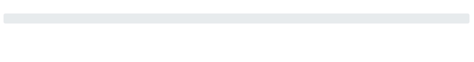
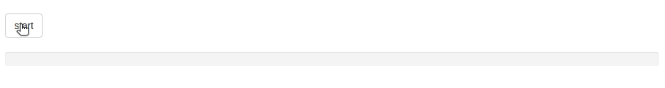
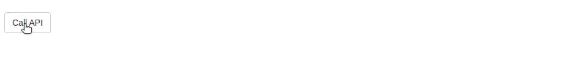

# Attendant

<Badge type="warning">New</Badge> The attendant is not 
currently on CRAN

A new family of functions to display progress bars using 
Bootstrap's built-in progress bars; waiter allows easily
animating them.

<Note>
Works with both Bootstrap 3 and 4.
</Note>

Unlike other families of functions in the packer the attendant
is not overlayed on top of other elements, choose where you 
would like it to be displayed and dynamically control its
state from the server.

## Basic

Place `attendantBar` in your UI where you would like the progress
bar to be displayed. Then from the server control it's state.

Note that we give the progress bar in the UI an id and reference
it server-side, ensure these are unique.

```r
library(shiny)
library(waiter)

ui <- fluidPage(
  useAttendant(),
  attendantBar("progress-bar")
)

server <- function(input, output){
  att <- Attendant$new("progress-bar")

  for(i in 1:10){
    Sys.sleep(runif(1))
    att$set(i * 10)
  }
}

shinyApp(ui, server)
```

## Customise

The look of the progress bar is controled from the UI function.
Below we create a green, striped, and animated progress bar that
goes up to 1000.

<Note type="warning">
The <code>animated</code> option will only work with bootstrap 4.
</Note>

```r {highlight: [5,'7-13']}
library(shiny)
library(waiter)

ui <- fluidPage(
  theme = bslib::bs_theme(version = 4),
  useAttendant(),
  attendantBar(
		"progress-bar",
		max = 1000,
		color = "success",
		striped = TRUE,
		animated = TRUE
	)
)

server <- function(input, output){
  att <- Attendant$new("progress-bar")

  for(i in 1:10){
    Sys.sleep(runif(1))
    att$set(i * 100)
  }
}

shinyApp(ui, server)
```



_You can also control the thickness of the progress bar._

## Text

You can optionallly display text on the progress bar.
While an initial text value can be defined in the UI,
this text can be updated from the server dynamically,
e.g.: below to display the percentage. 

```r
library(shiny)
library(waiter)

ui <- fluidPage(
  useAttendant(),
  attendantBar("progress-bar")
)

server <- function(input, output){
  att <- Attendant$new("progress-bar")

  for(i in 1:10){
    Sys.sleep(runif(1))
    att$set(i * 10, text = sprintf("%s%%", i * 10))
  }
}

shinyApp(ui, server)
```


## Auto

You can also use `auto` method to automatically increase the 
progress bar. Note that you will have to call the `done` method
when this should be stopped.

The `auto` method takes two arguments:

- `ms`: The number of milliseconds between every increase of the 
progress bar by `value` (see below).
- `value`: The value to increase the progress bar at every `ms`.

By default, it increases the progress bar by 1 every 400 ms. 

Improtantly, this is not an infinite progress bar, it runs out
at some point but can nonetheless be useful for long computations
the length of which cannot be determined ahead of time.

```r
library(shiny)
library(waiter)

ui <- fluidPage(
  useAttendant(),
  actionButton("start", "start"),
  attendantBar("progress-bar")
)

server <- function(input, output){
  att <- Attendant$new("progress-bar", hide_on_max = TRUE)

  observeEvent(input$start, {

    att$set(80) # start at 80%
    att$auto() # automatically increment

    on.exit({
      att$done() # after 4 seconds
    })

    Sys.sleep(4)
  })
}

shinyApp(ui, server)
```



## Use Case

You may have operations that take time, require a progress bar
to keep the user in the know and patiently waiting but which
cannot/should not be layered on top of other elements (as do
other waiter functions).

Below we create an `attendantBar`, add a class of `top-progress`
to it. Then with a bit of CSS make it such that this bar is

1. Initialised as hidden with `display: none`.
2. At the top of the page with `position: absolute;top:0;left:0;`
3. Make sure it takes the whole width of the page with `width:100%`.

Server-side we set `hide_on_max` to `TRUE` to make sure  that 1)
the progress bar is hidden again once `done` and 2) made visible
again when the progress bar is restarted.

```r
library(shiny)
library(waiter)

ui <- fluidPage(
  tags$head(
    tags$style(
      ".top-progress{
        display: none;
        position: absolute;
        top: 0;
        left: 0;
        width: 100%;
      }"
    )
  ),
  useAttendant(),
  attendantBar(
		"progress-bar",
    height = 3,
    class = 'top-progress'
	),
  br(),
  actionButton("start", "Call API"),
  verbatimTextOutput("response")
)

server <- function(input, output){
  att <- Attendant$new("progress-bar", hide_on_max = TRUE)

  response <- eventReactive(input$start, {
    # call the API here
    att$set(25)
    att$auto()

    on.exit({
      att$done()
    })

    Sys.sleep(7)
    "Response from the API!"
  })

  output$response <- renderPrint({
    response()
  })
}

shinyApp(ui, server)
```



This way the progress bar can be reused, even for other purposes
(as long as these do not run at the same time).
