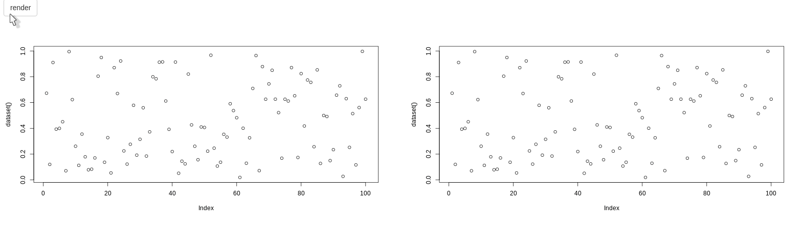

# The Hostess

The hostess is an addition of version `0.0.7` (currently only on Github).

The hostess can be used on its own but you likely will want to use it with the waiter. The hostess brings loading bars to the loading screen: reflect the progress made in the back end.

## How to

Note the hostess can work with the waiter, see examples.

1. Place `use_hostess` anywhere in your UI.
2. Place a `hostess_loader` where you want the bar to show.
3. Call `Hostess$new()` in your server to launch the hostess.
4. Increase the hostess with `Hostess$set`.

See `?hostess` for the documentation.

<Note type='tip'>
Make sure you include the dependencies with `use_hostess`.
</Note>

## With Waiter

You can of course use it together with `waiter` by playing the `hostess_spinner` in the `show_waiter*` function. Note that when used with the full page waiter one should set `center_page` to `TRUE` to center the loader.

```r {highlight: ['5-16',20,24,27]}
library(shiny)
library(waiter)

ui <- fluidPage(
  useWaiter(),
  useHostess(),
  waiterShowOnLoad(
    color = "#f7fff7",
    hostess_loader(
      "loader", 
      preset = "circle", 
      text_color = "black",
      class = "label-center",
      center_page = TRUE
    )
  )
)

server <- function(input, output){
  hostess <- Hostess$new("loader")

  for(i in 1:10){
    Sys.sleep(runif(1) / 2)
    hostess$set(i * 10)
  }
  
  waiter_hide()
}

shinyApp(ui, server)
```


If you want to show the waiting screen from the server (rather than on load as shown above) you can create the loader from the `Hostess` object, which is much more convenient.

```r {highlight: [5,6,11,16,20,23]}
library(shiny)
library(waiter)

ui <- fluidPage(
  useWaiter(),
  useHostess(),
  h1("Some content")
)

server <- function(input, output){
  hostess <- Hostess$new("loader")

  # to not have the screen flash bright white
  Sys.sleep(1)

  waiter_show(html = hostess$loader(center_page = TRUE))

  for(i in 1:10){
    Sys.sleep(runif(1) / 2)
    hostess$set(i * 10)
  }
  
  waiter_hide()
}

shinyApp(ui, server)
```

The Hostess is powered by [loadinBar.js](https://loading.io/progress/) which comes with tons of styling options to pass to `hostess_loader`, check them out! 

## Multiple

The above method of creating the loader also enables creating multiple loaders tied to the same hostess, so one hostess can set or increment multiple loading bars.

```r {highlight: [5,6,'17-21',26,30]}
library(shiny)
library(waiter)

ui <- fluidPage(
  useWaiter(),
  useHostess(), # include dependencies
  actionButton("btn", "render"),
  fluidRow(
    column(6, plotOutput("plot1")),
    column(6, plotOutput("plot2"))
  )
)

server <- function(input, output){

  # n = 2 loaders
  host <- Hostess$new(n = 2)
  w <- Waiter$new(
    c("plot1", "plot2"),
    html = host$get_loader()
  )

  dataset <- reactive({
    input$btn

    w$show()

    for(i in 1:10){
      Sys.sleep(.3)
      host$set(i * 10)
    }

    runif(100)
  })

  output$plot1 <- renderPlot(plot(dataset()))
  output$plot2 <- renderPlot(plot(dataset()))
}

shinyApp(ui, server)
```



## Standalone

Initialise the hostess with `Hostess$new()` to which you pass the id of the `hostess_loader` you are using, then increment it with the `set` method. 

```r {highlight: [5,6,12,17]}
library(shiny)
library(waiter)

ui <- fluidPage(
  useHostess(), # include dependencies
  hostess_loader("load", text_color = "black", center_page = TRUE)
)

server <- function(input, output){
  
  # initialise
  hostess <- Hostess$new("load")
  
  # increment
  for(i in 1:10){
    Sys.sleep(runif(1)) # random sleep
    hostess$set(i * 10)
  }
}

shinyApp(ui, server)
```


## Infinite

An infinite loading bar is useful when you cannot compute increments.

<Note type='tip'>
When using <code>infinite</code> the hostess must be closed when the computation ends
</Note>

```r {highlight: ['5-16',20,22,27]}
library(shiny)
library(waiter)

ui <- fluidPage(
  useWaiter(),
  useHostess(),
  waiterShowOnLoad(
    color = "#f7fff7",
    hostess_loader(
      "loader", 
      preset = "circle", 
      text_color = "black",
      class = "label-center",
      center_page = TRUE
    )
  )
)

server <- function(input, output){
  hostess <- Hostess$new("loader", infinite = TRUE)
  
  hostess$start()
  
  # ... computation here ... # 
  Sys.sleep(5) # simulating a 5 seconds computation
  
  hostess$close()
  waiter_hide()
}

shinyApp(ui, server)
```

Multiple loaders tied to a single infinite hostess can also be created:

```r {highlight: [5,6,'17-21',26,27,33]}
library(shiny)
library(waiter)

ui <- fluidPage(
  useWaiter(),
  useHostess(), # include dependencies
  actionButton("btn", "render"),
  fluidRow(
    column(6, plotOutput("plot1")),
    column(6, plotOutput("plot2"))
  )
)

server <- function(input, output){
  
  # n = 2 loaders
  host <- Hostess$new(n = 2, infinite = TRUE)
  w <- Waiter$new(
    c("plot1", "plot2"),
    html = host$get_loader()
  )
  
  dataset <- reactive({
    input$btn
    
    w$show()
    host$start()
    
    # ... computation here ... # 
    Sys.sleep(5) # simulating a 5 seconds computation
    res <- runif(100)
    
    host$close()
    return(res)
  })
  
  output$plot1 <- renderPlot(plot(dataset()))
  output$plot2 <- renderPlot(plot(dataset()))
}

shinyApp(ui, server)
```
