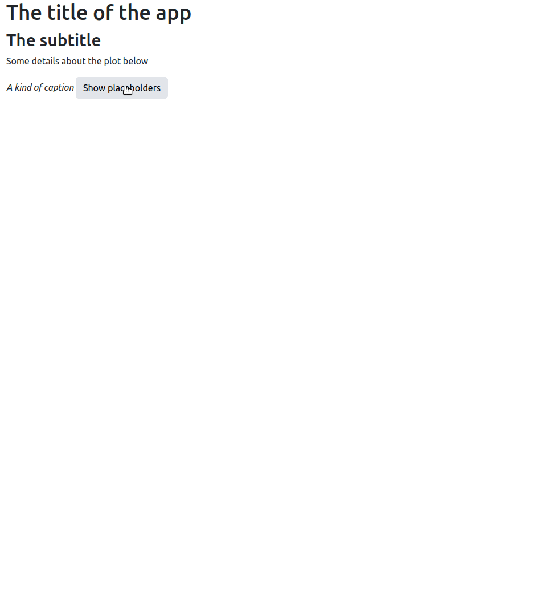

# Placeholder

<Badge type="warning">New</Badge> The placeholder is not 
currently on CRAN.

## Example

Simply create a `Placeholder` object and pass it the selectors
you want to temporarily turn into placeholders.
You can also define the type of placeholder effect.

```r
library(shiny)
library(waiter)

ui <- fluidPage(
  theme = bslib::bs_theme(version = 5L),
  usePlaceholder(),
  h1("The title of the app"),
  h2("The subtitle"),
  p("Some details about the plot below"),
  tags$i("A kind of caption"),
  actionButton("show", "Show placeholders")
)

server <- function(input, output, session){
  p <- Placeholder$new(
    c(
      "p",
      "i",
      "a",
      "#show",
      "h1",
      "h2"
    ),
    type = "glow"
  )

  observeEvent(input$show, {
    p$show()
    Sys.sleep(3)
    on.exit({
      p$hide()
    })
  })
}

shinyApp(ui, server, options = list(port = 3000L))
```


