# The Waiter

The waiter lets you show splash loading screens. 

## Combos

The waiter works hand-in-hand with the `steward` and the `hostess`. The former will let you animate the background of your loading screen while the latter will let you show loading bars on the loading screen.

## Examples

There is an online demo with a list of all [100+ spinners](https://shiny.john-coene.com/waiter/) available, you can also see the list of available spinners in R with `?spinners`.

> [!TIP]
> In the development version currently on Github (`0.1.1.9000`) you can reduce the load size of the CSS files in `use_waiter` which now takes a `spinners` argument to which one can specify any of 7 spinner CSS kits, by default all kits are loaded so nothing breaks. You can know which kits should be specified by simply typing the spinner in the console, e.g.: `spin_rotating_plane()`. See an example at [the bottom of this page](#css-load).

Note that in the latest version you can also preview the spinners in the browser or RStudio viewer with the `preview_spinner` function like so:

```r
preview_spinner(spin_4())
```

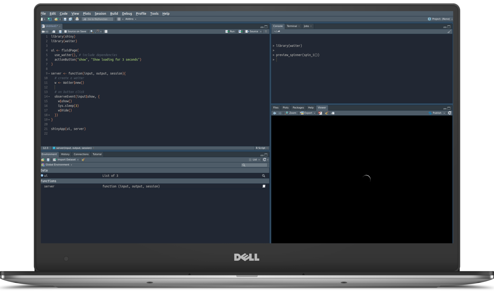

### On Load

You can show a loading screen on app launch. The loading screen will launch prior to everything else, even the Shiny session. 

Though this function is not programmatically launched it still has to be hidden with `waiter_hide`. Ensure you place `waiter_show_on_load` after `use_waiter`.

```r
library(shiny)
library(waiter)
 
ui <- fluidPage(
  use_waiter(), 
  waiter_show_on_load(html = spin_fading_circles()), # place at the top before content
  h3("Content you will only see after loading screen has disappeared")
)

server <- function(input, output, session){
  Sys.sleep(3) # do something that takes time
  waiter_hide()
}

shinyApp(ui, server)
```

### On busy

In the development version, not yet on CRAN, one can use `waiter_on_busy` to automatically display the loading screen when the server is busy computing things and automatically remove it when it goes back to idle.

```r
library(shiny)
library(waiter)

ui <- fluidPage(
  use_waiter(),
  waiter_on_busy(),
  actionButton("render", "render"),
  plotOutput("plot")
)

server <- function(input, output){

  output$plot <- renderPlot({
    input$render
    Sys.sleep(2)
    plot(cars)
  })

}

shinyApp(ui, server)
```

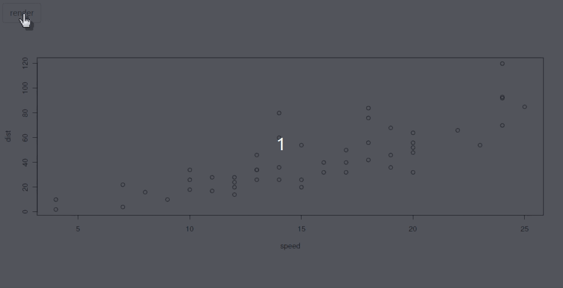

### Dynamic Updates

You can also update the `html` of the waiting screen while it's loading, useful if you want to give users more detailed updates.

```r
library(shiny)
library(waiter)
 
ui <- fluidPage(
  use_waiter(),
  actionButton("show", "Show loading with updates")
)

server <- function(input, output, session){
  # create the waiter
  w <- Waiter$new(html = span("Initialising"))

  msgs <- c("Loading data", "Running model", "Drawing plots")

  observeEvent(input$show, {
    w$show()

    Sys.sleep(2)
    
    for(i in 1:3){
      w$update(html = msgs[i])
      Sys.sleep(2)
    }

    w$hide()
  })
}

shinyApp(ui, server)
```

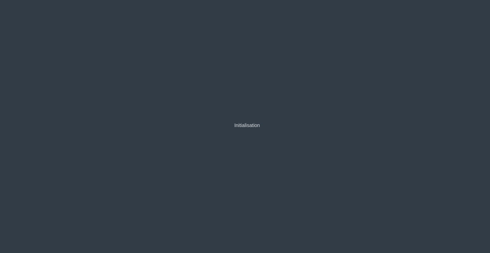

### Partial

Since version `0.1.0` you are no longer limited to full page loading screens and can show the waiter only only part of the application, whichever part you desire. 

> [!NOTE]
> All the features of the full screen are also available on partial loading screens

Let us demonstrate with a basic Shiny application that includes a single plot which is updated upon clicking an action button. The way we layer the waiter on top of an element is simply by specifying the `id` of said element when we initialise the waiter.

```r
library(shiny)
library(waiter)

ui <- fluidPage(
  use_waiter(),
  actionButton("draw", "draw plot"),
  plotOutput("plot")
)

server <- function(input, output){

  # specify the id 
  w <- Waiter$new(id = "plot")

  dataset <- reactive({
    input$draw

    w$show()

    on.exit({
      w$hide()
    })

    Sys.sleep(3)   

    runif(100)
  })

  output$plot <- renderPlot(plot(dataset()))

}

shinyApp(ui, server)
```

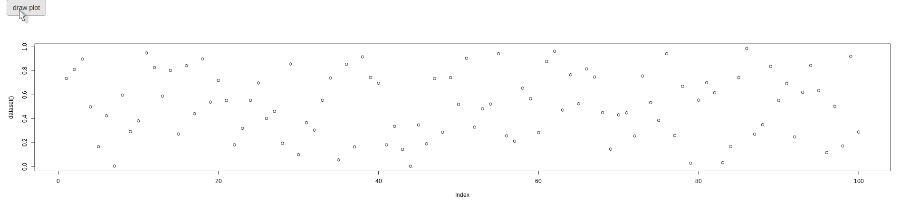

### On Render

We can actually further simplify the application above: we do not in fact need to use the `hide` method. By default when specifying an `id` waiter will hide the waiting screen when the element, in our case a plot, is rendered. This applies to plots, tables, htmlwidgets, etc. Below we simplify the app, removing the `hide` method and demonstrate that it works on a `tableOutput` and `htmlwidgets` (a [highcharter](http://jkunst.com/highcharter/) chart in this case). We also show that we can pass multiple ids to the waiter to have it show over multiple elements at once.

```r
library(shiny)
library(waiter)
library(highcharter)

ui <- fluidPage(
  use_waiter(),
  actionButton("draw", "render stuff"),
  fluidRow(
    column(3, tableOutput("table")),
    column(9, highchartOutput("hc"))
  )
)

server <- function(input, output){

  # specify the id 
  w <- Waiter$new(id = c("hc", "table"))

  dataset <- reactive({
    input$draw

    w$show()

    Sys.sleep(3)

    head(cars)
  })

  output$table <- renderTable(dataset())
  output$hc <- renderHighchart({
    hchart(dataset(), "scatter", hcaes(speed, dist))
  })

}

shinyApp(ui, server)
```

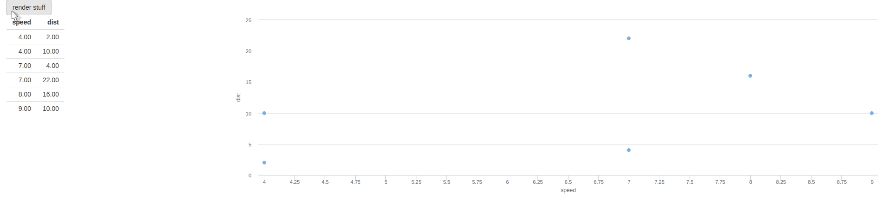

Note that one might still want to use the `hide` method if one does not layer the waiting screen over a rendered element (if it is not dynamically rendered there is no way for the waiter to know its content has changed).

```r
library(shiny)
library(waiter)

ui <- fluidPage(
  use_waiter(),
  fluidRow(
    column(3, actionButton("draw", "render table")),
    column(
      9, 
      id = "waiter",
      style = "height:100vh;",
      h1("The plot"),
      plotOutput("plot")
    )
  )
)

server <- function(input, output){

  # specify the id 
  w <- Waiter$new(id = "waiter")

  dataset <- reactive({
    input$draw

    w$show()

    Sys.sleep(3) 

    w$hide()

    runif(150)
  })

  output$plot <- renderPlot(plot(dataset()))

}

shinyApp(ui, server)
```

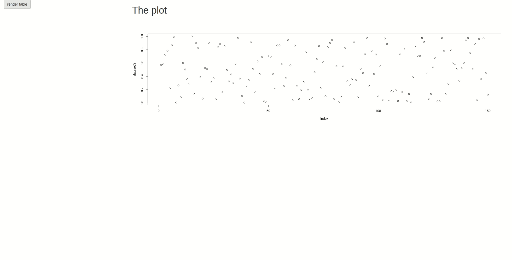

### Color

Waiter sets the `color` argument in CSS, therefore hex values (e.g.: `#ffffff`), rgb (e.g.: `rgb(255, 255, 255)`), a string (e.g.: `white`) as well as rgba (e.g.: `rgb(255, 255, 255, .5)`) are valid and must be passed as string, e.g.: `"rgba(255,255,255,.5)"`. There is a convenience function called `transparent` which sets the background as transparent but can be set to a more opaque white~ish color with the `alpha` parameter.

```r
library(shiny)
library(waiter)

ui <- fluidPage(
  use_waiter(),
  actionButton("draw", "draw plot"),
  plotOutput("plot")
)

server <- function(input, output){

  # transparent~ish background
  w <- Waiter$new(
    id = "plot",
    html = spin_google(), 
    color = transparent(.5)
  )

  dataset <- reactive({
    input$draw

    w$show()

    Sys.sleep(3)   

    runif(100)
  })

  output$plot <- renderPlot(plot(dataset()))

}

shinyApp(ui, server)
```

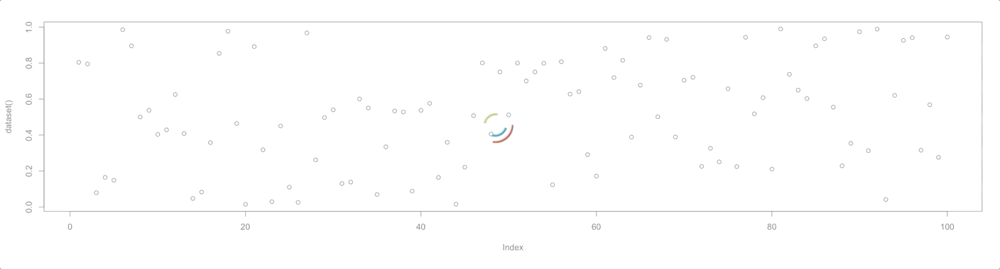

### Content

Thus far we have been using built-in spinners but you are by no means restricted to them. Waiter will let you use any HTML content you like, either as a string (e.g.: `<p>Loading...</p>`) and more conveniently [htmltools](https://cran.r-project.org/web/packages/htmltools/index.html) or shiny tags such e.g.(`shiny::p("Loading...")`). You may thus use those to provide richer messages with images, gif, whatever you fancy.

```r
library(shiny)
library(waiter)

# a notorious gif
gif <- paste0("https://media1.tenor.com/images",
  "/cb27704982766b4f02691ea975d9a259/tenor.gif?itemid=11365139")

loading_screen <- tagList(
  h3("Bear with Hadley a second", style = "color:gray;"),
  img(src = gif, height = "200px")
)
 
ui <- fluidPage(
  use_waiter(), # include dependencies
  actionButton("show", "Show loading for 4 seconds")
)

server <- function(input, output, session){
  # create a waiter
  w <- Waiter$new(html = loading_screen, color = "white")

  # on button click
  observeEvent(input$show, {
    w$show()
    Sys.sleep(4)
    w$hide()
  })
}

shinyApp(ui, server)
```


## Theming

In the development version (from Github) you can now easily create themes for your loading screens. You can also override that in individual waiter if needed.

```r
library(shiny)
library(waiter)

# set a theme
waiter_set_theme(html = spin_3(), color = "darkblue")

ui <- fluidPage(
  use_waiter(),
  actionButton("show", "Show loading with updates"),
  plotOutput("plot1"),
  plotOutput("plot2")
)

server <- function(input, output, session){
  
  # the theme is automatically applied
  w <- Waiter$new(c("plot1", "plot2"))

  dataset <- reactive({
    input$show
    w$show()
    Sys.sleep(3)
    hist(runif(100))
  })

  output$plot1 <- renderPlot({plot(dataset())})
  output$plot2 <- renderPlot({plot(dataset())})
}

shinyApp(ui, server)
```

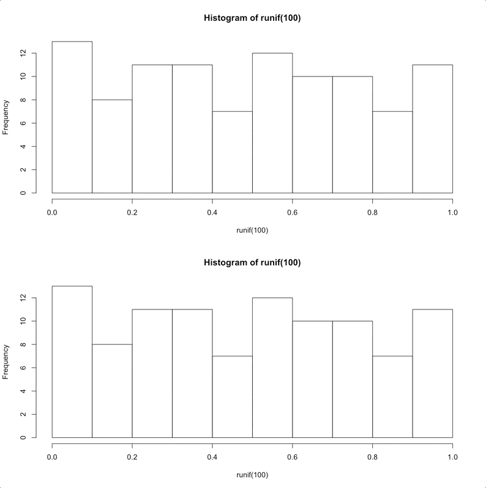

## With Hostess

The API of the hostess has been somewhat improved since its initial release; the "loader" can be created from the R6Class itself, which is the recommended approach as it simplifies much of the workflow.

> [!TIP]
> Make sure you include the dependencies with `use_hostess`.

The hostess-waiter team will work as layers over parts of the application.

```r
library(shiny)
library(waiter)
 
ui <- fluidPage(
  use_waiter(), 
  use_hostess(),
  actionButton("draw", "plot"),
  plotOutput("plot")
)

server <- function(input, output, session){
  # create the waitress
  hostess <- Hostess$new()

  # set the loader as html
  waiter <- Waiter$
    new(
      "plot", 
      html = hostess$get_loader(stroke_color = "#ffffff")
    )

  dataset <- reactive({
    input$draw
    waiter$show()

    for(i in 1:10){
      hostess$set(i * 10)
      Sys.sleep(.3)
    }

    runif(50)
  })

  output$plot <- renderPlot(plot(dataset()))
}

shinyApp(ui, server)
```

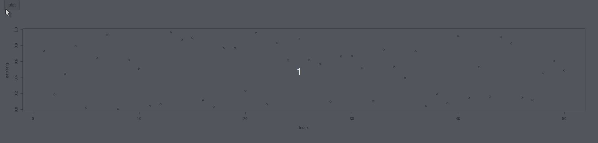

The approach above might get too wordy when one wants to use a hostess on multiple waiting screens. Take for instance the application above but with more than one plot.

```r
library(shiny)
library(waiter)

ui <- fluidPage(
  use_waiter(), 
  use_hostess(),
  actionButton("draw", "plot"),
  fluidRow(
    column(4, plotOutput("plot1")),
    column(4, plotOutput("plot2")),
    column(4, plotOutput("plot3"))
  )
)

server <- function(input, output, session){
  # create a common loader
  loader <- hostess_loader(stroke_color = "red")

  # create the waitress and set loader
  hostess1 <- Hostess$new()$set_loader(loader)
  hostess2 <- Hostess$new()$set_loader(loader)
  hostess3 <- Hostess$new()$set_loader(loader)

  # set the loader as html
  waiter <- Waiter$new(
    c("plot1", "plot2", "plot3"),
    html = list(
      hostess1$get_loader(),
      hostess2$get_loader(),
      hostess3$get_loader()
    )
  )

  dataset <- reactive({
    input$draw
    waiter$show()

    for(i in 1:10){
      hostess1$set(i * 10)
      hostess2$set(i * 10)
      hostess3$set(i * 10)
      Sys.sleep(.3)
    }

    runif(50)
  })

  output$plot1 <- renderPlot(plot(dataset()))
  output$plot2 <- renderPlot(plot(dataset()))
  output$plot3 <- renderPlot(plot(dataset()))
}

shinyApp(ui, server)
```

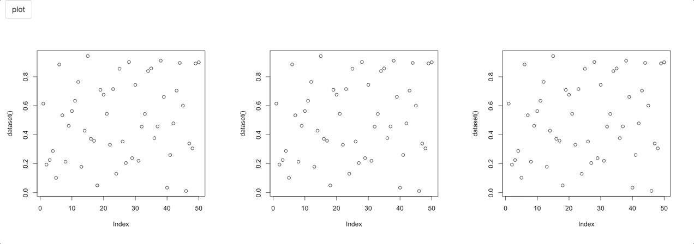

## With Steward

To use the steward, simply add `use_steward`, it takes a few arguments to customise its look and feel.

> [!TIP]
> Make sure you include the dependencies with `use_steward`.

```r
library(shiny)
library(waiter)
 
ui <- fluidPage(
  use_waiter(), 
  use_steward(),
  h3("Content you will only see after loading screen has disappeared"),
  waiter_show_on_load(spin_fading_circles()) 
)

server <- function(input, output, session){
  Sys.sleep(10) # do something that takes time
  waiter_hide()
}

shinyApp(ui, server)
```


## With Garçon

Then again don't forget to add the dependency by placing `use_garcon` in the UI. Initialise the garçon then add progress by setting the percentage with the `set` method where you select the image to animate by passing its id.

> [!TIP]
> Make sure you include the dependencies with `use_garcon`.

```r
library(shiny)
library(waiter)

ui <- fluidPage(
  use_garcon(),
  use_waiter(),
  waiter_show_on_load(
    tags$img(
      src="https://waiter.john-coene.com/_assets/img/logo.png", 
      height=200, 
      id = "myImage" # set id
    )
  )
)

server <- function(input, output){
  g <- Garcon$new("myImage", filter = "opacity")

  for(i in 1:10){
    Sys.sleep(runif(1))
    g$set(i * 10)
  }

  waiter_hide()
}

shinyApp(ui, server)
```


There are a number of filters available.

## CSS Load

In the development version currently on Github (`0.1.1.9000`) you can reduce the load size of the CSS files in `use_waiter` which now takes a `spinners` argument to which one can specify any of 7 spinner CSS kits, by default all kits are loaded so nothing breaks. You can know which kits should be specified by simply typing the spinner in the console.

```r
spin_rotating_plane()                                                                  
#> spin_rotating_plane() requires spinner kit #1, include it with:
#> use_waiter(spinners = 1) 
```

> [!NOTE]
> You can specify multiple spinners with vector, e.g.: `c(1,3,7)`.

This tells you that only spinner kit number 1 is required.

```r
library(shiny)
library(waiter)
 
ui <- fluidPage(
  use_waiter(spinners = 1)
)

server <- function(input, output, session){
  Waiter$
    new(html = spin_rotating_plane())$
    show()
}

shinyApp(ui, server)
```

This makes it lighter for the browser to load.

## Events

The waiter also fires events in shiny when:

1. The loading screen is _shown_
2. The loading screen is _hidden_

These events are set to `id` that the waiter overlays followed by `_waiter_shown` or `_waiter_hidden`.

```r
library(shiny)
library(waiter)

ui <- fluidPage(
  use_waiter(),
  actionButton("draw", "draw plot"),
  plotOutput("plot")
)

server <- function(input, output){

  # sets: 
  # input$plot_waiter_shown
  # input$plot_waiter_hidden
  w <- Waiter$new(id = "plot")

  dataset <- reactive({
    input$draw

    w$show()

    on.exit({
      w$hide()
    })

    Sys.sleep(3)  

    runif(100)
  })

  output$plot <- renderPlot(plot(dataset()))

  observeEvent(input$plot_waiter_hidden, {
    print(input$plot_waiter_hidden)
  })

  observeEvent(input$plot_waiter_shown, {
    print(input$plot_waiter_shown)
  })

}

shinyApp(ui, server)
```

If the waiter is not overlayed upon any element and is used full screen then the events `waiter_shown` and `waiter_hidden` are fired.

## CSS

The overlay that waiter places (with background color) bears the `waiter-overlay` class, the content (spinner and/or text) is placed within it in a `<div>` with class `waiter-overlay-content`.

This is useful to know if you want to customise the default appearance, e.g.: placement of the spinner.

```r
library(shiny)
library(waiter)

ui <- fluidPage(
  use_waiter(), # include dependencies
  tags$style(
    ".waiter-overlay-content{
      position: absolute;
      top: 30px; /*30 pixels from the top*/
      left: 48%; /*48% from the left*/
    }"
  ),
  actionButton("showFull", "Show full screen"),
  actionButton("showPartial", "Show partial"),
  div(
    id = "hello", 
    style = "width:400px;height:500px;",
    h4("This could be a chart of whatever")
  )
)

server <- function(input, output, session){
  # partial
  w1 <- Waiter$new("hello")

  observeEvent(input$showPartial, {
    w1$show()
    Sys.sleep(4)
    w1$hide()
  })

  # full screen
  w2 <- Waiter$new()

  observeEvent(input$showFull, {
    w2$show()
    Sys.sleep(4)
    w2$hide()
  })
}

shinyApp(ui, server)
```

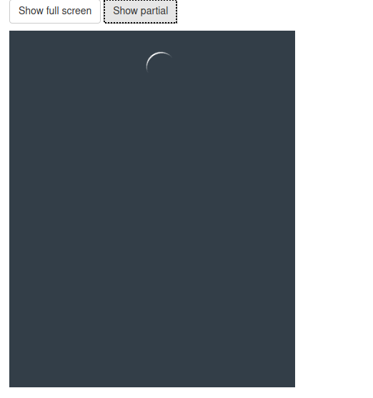
