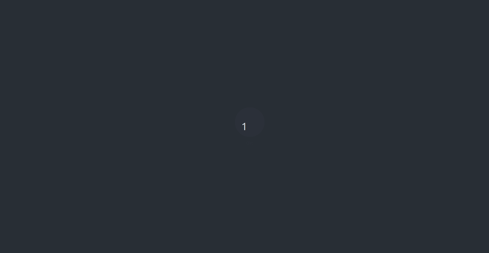

# The Waiter

The waiter lets you show splash loading screens. 

## How to

1. Place `use_waiter` anywhere in your UI.
2. Programmatically call `show_waiter` or use `show_waiter_on_load`.
3. Then hide the loading screen with `hide_waiter` or `hide_waiter_on_drawn`.

The waiter works hand-in-hand with the `steward` and the `hostess`. The former will let you animate the background of your loading screen while the latter will let you show loading bars on the loading screen.

> [!TIP]
> Make sure you include the dependencies with `use_waiter`.

## Examples

### Basics

A basic example could be like this.

``` r
library(shiny)
library(waiter)
 
ui <- fluidPage(
  use_waiter(), # include dependencies
  actionButton("show", "Show loading for 3 seconds")
)

server <- function(input, output, session){
  observeEvent(input$show, {
    waiter_show()
    Sys.sleep(3) # do something that takes time
    waiter_hide()
  })
}

shinyApp(ui, server)
```


### On Load

Since version `0.0.4` you can show on loading screen on app launch. The loading screen will launch prior to anything, even the Shiny session. Note that in `0.0.4` some content flashed before the loader appeared, this has been fixed in `0.0.5`.

> [!NOTE]
> You can have multiple waiters but only one active at a time.

Though this function is not programmatically launched it still has to be hidden with `hide_waiter`. Ensure you place `show_waiter_on_load` after `use_waiter` and at _the very end of your UI_, also set `include_js` to `FALSE`, in `use_waiter`.

```r
library(shiny)
library(waiter)
 
ui <- fluidPage(
  use_waiter(include_js = FALSE), # do not include js
  h3("Content you will only see after loading screen has disappeared"),
  waiter_show_on_load(html = spin_fading_circles()) # place at the bottom
)

server <- function(input, output, session){
  Sys.sleep(3) # do something that takes time
  waiter_hide()
}

shinyApp(ui, server)
```

How it is used in [chirp.sh](https://chirp.sh), where it is combined with [pushbar](https://github.com/JohnCoene/pushbar) to get rid of the navbar alltogether.

```r
library(shiny)
library(waiter)

ui <- navbarPage(
  "example",
  id = "tabs",
    header = list(
        tags$style("nav{display:none;}") # hide navbar
    ),
  tabPanel(
    "home",
    use_waiter(),
    br(),
    actionButton("switch", "Go to networks tab")
  ),
  tabPanel(
    "networks",
    h3("Hello!")
  )
)

server <- function(input, output, session){
  observeEvent(input$switch, {

    # show loading
    waiter_show(
      html = tagList(
        spin_folding_cube(),
        span("Loading ...", style = "color:white;")
      )
    )
    # long~ish computation
    Sys.sleep(3)

    # send to "hidden" tab
    updateTabsetPanel(session = session, inputId = "tabs", selected = "networks")

    # hide loading
    waiter_hide()
  })
}

shinyApp(ui, server)
```

### Dynamic Updates

You can, since version `0.0.6` update the `html` of the waiting screen while it's loading.

```r
library(shiny)
library(waiter)
 
ui <- fluidPage(
  use_waiter(),
  actionButton("show", "Show loading with updates")
)

server <- function(input, output, session){
  observeEvent(input$show, {
    waiter_show(html = span("Initialisation", style = "color:white;"))
    Sys.sleep(2)
    for(i in 1:5){
      HTML <- span(paste("Loading #", i, "of 5"), style = "color:white;z-index:999;")
      waiter_update(html = HTML)
      Sys.sleep(2)
    }
    waiter_hide()
  })
}

shinyApp(ui, server)
```


### With Steward

To use the steward, simply add `use_steward`, it takes a few arguments to customise its look and feel.

```r
library(shiny)
library(waiter)
 
ui <- fluidPage(
  use_waiter(include_js = FALSE), 
  use_steward(),
  h3("Content you will only see after loading screen has disappeared"),
  waiter_show_on_load(spin_fading_circles()) 
)

server <- function(input, output, session){
  Sys.sleep(10) # do something that takes time
  waiter_hide()
}

shinyApp(ui, server)
```


### With Hostess

Include the hostess dependencies with `use_hostess`, place the `hostess_loader` in the `show_waiter*` function then programmatically set the percentage with the `set` method. 

```r
library(shiny)
library(waiter)
 
ui <- fluidPage(
  use_waiter(include_js = FALSE), 
  use_hostess(),
  h3("Content you will only see after loading screen has disappeared"),
  waiter_show_on_load(hostess_loader("loader", preset = "bubble", center_page = TRUE)) 
)

server <- function(input, output, session){
  host <- Hostess$new("loader")

  for(i in 1:10){
    Sys.sleep(runif(1) * 1.2)
    host$set(i * 10)
  }

  waiter_hide()
}

shinyApp(ui, server)
```




### With garçon

Then again don't forget to add the dependency by placing `use_garcon` in the UI. Initialise the garçon then add progress by setting the percentage with the `set` method where you select the image to animate by passing its id.

```r
library(shiny)
library(waiter)

ui <- fluidPage(
  use_garcon(),
  use_waiter(),
  waiter_show_on_load(
    tags$img(
      src="https://waiter.john-coene.com/_assets/img/logo.png", 
      height=200, 
      id = "myImage" # set id
    )
  )
)

server <- function(input, output){
  g <- Garcon$new("myImage", filter = "opacity")

  for(i in 1:10){
    Sys.sleep(runif(1))
    g$set(i * 10)
  }

  waiter_hide()
}

shinyApp(ui, server)
```


There are a number of filters available.
