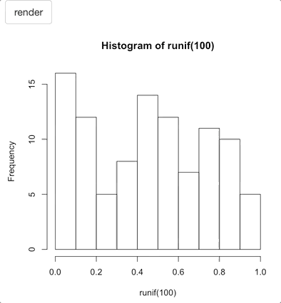
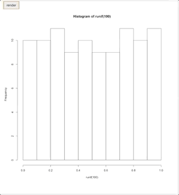
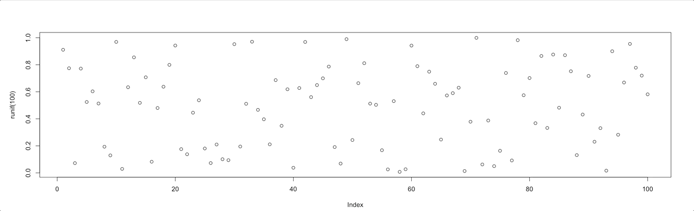
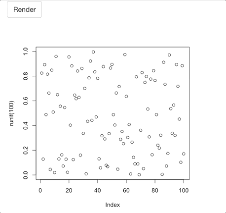

# The Waitress

The waitress will let you display loading bars on the entire screen or specific elements only.

## How to

Note that the waitress is a reference class.

1. Place `use_waitress` anywhere in your UI.
2. Set up the waitress in your server with `call_waitress` or `Waitress$new()`.
3. Programatically call the `set`, `inc`, and `auto` methods.
4. Don't forget to programatically hide the loading screen with the `close` method.

See `?waitress` for the documentation.

<Note type='tip'>
Make sure you include the dependencies with `use_waitress`.
</Note>

## Plot

The waitress can be applied to a specific element or the whole page. Note that `call_waitress` and `Waitress$new()` takes a CSS selector, so if you want to apply it to a plot use `#plotId`.

```r
library(shiny)
library(waiter)

ui <- fluidPage(
  useWaitress(),
  plotOutput("plot", width = 400)
)

server <- function(input, output){
  
  waitress <- Waitress$new("#plot") # call the waitress
  
  output$plot <- renderPlot({
    
    for(i in 1:10){
      waitress$inc(10) # increase by 10%
      Sys.sleep(.3)
    }
    
    hist(runif(20))
    waitress$close() # hide when done
	})

}

shinyApp(ui, server)
```


## Selector

Because the waitress takes a selector, we can apply it to different parts of the page, using a class or any other selector, like the `nav`. Note that you can set the range of the progress bar when you initialise it, you are not limited to percentages.

```r
library(shiny)
library(waiter)

ui <- navbarPage(
  "Waitress on nav",
  tabPanel(
    "home",
    useWaitress(),
    plotOutput("plot")
    )
)

server <- function(input, output){
  
  # now waitress ranges from 0 to 100
  waitress <- Waitress$new("nav", theme = "overlay", min = 0, max = 10)
  
  output$plot <- renderPlot({
    
    for(i in 1:10){
      waitress$inc(1) # increase by 10%
      Sys.sleep(.5)
    }
    
    hist(runif(100))
    waitress$close() # hide when done
	})

}

shinyApp(ui, server)
```


## Page

If you do not specify a selector to `call_waitress` then it is applied to the whole page. Note that you can change the color of the waitress in `use_waitress`.

```r
library(shiny)
library(waiter)

ui <- fluidPage(
  useWaitress(color = "#7F7FFF"),
  h2("waitress on entire page"),
  actionButton("load", "load")
)

server <- function(input, output){
  
  waitress <- Waitress$new(theme = "overlay-percent") # call the waitress
  
  observeEvent(input$load, {
    waitress$
      auto(percent = 5, ms = 150) # increase by 5 percent every 150 milliseconds
      Sys.sleep(3.5)
    waitress$close()
	})

}

shinyApp(ui, server)
```


## Infinite

An infinite loading bar is useful when you cannot compute increments.

```r
library(shiny)
library(waiter)

ui <- fluidPage(
  useWaitress(),
  actionButton("btn", "render"),
  plotOutput("plot", width = 400)
)

server <- function(input, output){
  
  waitress <- Waitress$new("#btn", theme = "overlay", infinite = TRUE)
  
  output$plot <- renderPlot({
    input$btn

    waitress$start()
    
    Sys.sleep(3)
    
    hist(runif(100))
    waitress$close() # hide when done
	})

}

shinyApp(ui, server)
```



## Notifications

You can also use the waitress to display notifications.

```r
library(shiny)
library(waiter)

ui <- fluidPage(
  useWaitress(),
  actionButton("btn", "render"),
  plotOutput("plot", height = "90vh")
)

server <- function(input, output){
  
  waitress <- Waitress$new(theme = "overlay-percent", min = 0, max = 10)
  
  output$plot <- renderPlot({
    input$btn

    # use notification
    waitress$notify()
    
    for(i in 1:10){
      waitress$inc(1) # increase by 10%
      Sys.sleep(.3)
    }
    
    hist(runif(100))
    waitress$close() # hide when done
	})

}

shinyApp(ui, server)
```



## Message

You can also layer a message on the waitress.

```r
library(shiny)
library(waiter)

ui <- fluidPage(
  useWaitress(),
  plotOutput("plot")
)

server <- function(input, output){
  
  waitress <- Waitress$new("#plot") # call the waitress
  
  output$plot <- renderPlot({
    waitress$start(h3("Loading Stuff..."))
    
    for(i in 1:10){
      waitress$inc(10) # increase by 10%
      Sys.sleep(.3)
    }
    
    plot(runif(100))
    waitress$close() # hide when done
	})

}

shinyApp(ui, server)
```



# On render

Like the waiter, the waitress can be hidden when the element (plot, table, etc.) which it covers is rendered.

```r
library(shiny)
library(waiter)

ui <- fluidPage(
  useWaitress(),
  actionButton("btn", "Render"),
  plotOutput("plot", width = 400)
)

server <- function(input, output){
  
  waitress <- Waitress$new("#plot", hide_on_render = TRUE) # call the waitress
  
  output$plot <- renderPlot({
    input$btn

    waitress$start()
    
    for(i in 1:10){
      waitress$inc(10) # increase by 10%
      Sys.sleep(.3)
    }
    
    plot(runif(100))
	})

}

shinyApp(ui, server)
```

